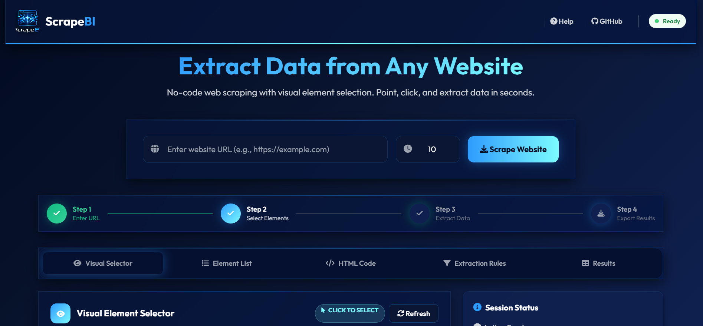

<p align="center">
  
</p>

<h1 align="center">🕷️ ScrapeBI - No-Code Web Scraping Tool</h1>

<p align="center">
  A powerful, user-friendly web scraping tool built with Python, Selenium, and Flask. Features a visual element selector that allows you to extract data from websites without writing any code.
</p>

<p align="center">
  
  
  
  
  
</p>



## ✨ Features

- 🔍 **Visual Element Selector** - Click on elements in a live preview to select them
- 📋 **Element Detection** - Automatically detects and categorizes all page elements
- 🎯 **No-Code Extraction** - Create extraction rules with CSS selectors, XPath, or element properties
- 📊 **Multiple Export Formats** - Export data as JSON, CSV, or TXT
- 🖥️ **Modern UI** - Clean, responsive interface with real-time previews
- ⚡ **Quick Extract** - One-click extraction of common elements (headings, links, images, etc.)
- 💾 **Save Rules** - Save and reuse extraction rules across different pages
- 🔄 **Batch Processing** - Run multiple extraction rules at once

## 🚀 Quick Start

### Prerequisites

- Python 3.8 or higher
- Google Chrome browser (ChromeDriver will be auto-installed)

### Installation

1. **Clone or download the project:**
   ```bash
   git clone https://github.com/RaoHamzaTariq/ScrapeBI.git
   cd ScrapeBI
   ```

2. **Install dependencies:**
   ```bash
   pip install -r requirements.txt
   ```

3. **Run ScrapeBI:**
   ```bash
   python run.py
   ```

   Or simply double-click `start.bat` (Windows) or run `./start.sh` (macOS/Linux).

4. **Open your browser:**
   The application will automatically open at `http://localhost:5000`

For detailed installation instructions, see the [Installation Guide](docs/installation.md).

## 📖 How to Use

### 1. Scrape a Website

1. Enter the URL of the website you want to scrape
2. Set the wait time (how long to wait for the page to load)
3. Click the **"Scrape"** button

### 2. Select Elements

- **Visual Selector:** See a live preview and click elements to select them
- **Element List:** Browse elements organized by category (headings, links, images, etc.)

### 3. Create Extraction Rules

1. Click **"Add Rule"** or select an element
2. Choose selector type (CSS, XPath, Tag, Class, or ID)
3. Enter the selector value
4. Choose what to extract (text, HTML, href, src, etc.)
5. Click **"Save Rule"**

### 4. Export Data

- Run extraction rules
- Export results as **JSON**, **CSV**, or **TXT**

For a complete tutorial, see the [Quick Start Guide](docs/quickstart.md).

## 🎯 Quick Extract Shortcuts

Use the sidebar for instant extraction:
- **All Headings** - Extract all H1-H6 elements
- **All Links** - Extract all link URLs
- **All Images** - Extract all image sources
- **All Paragraphs** - Extract all paragraph text
- **All Tables** - Extract all table HTML

## 📝 CSS Selector Examples

| Selector | Description |
|----------|-------------|
| `.title` | Elements with class "title" |
| `#header` | Element with ID "header" |
| `h1, h2, h3` | All heading elements |
| `a[href^="https"]` | Links starting with "https" |
| `div > p` | Direct child paragraphs |
| `.product .price` | Price elements inside product |
| `[data-testid]` | Elements with data-testid attribute |

For more selector examples, see the [Advanced Selectors Guide](docs/advanced-selectors.md).

## 🏗️ Project Structure

```
ScrapeBI/
├── app.py                 # Main Flask application
├── run.py                 # Entry point script
├── requirements.txt       # Python dependencies
├── README.md              # This file
├── .gitignore             # Git ignore file
├── docs/                  # Documentation folder
│   ├── README.md          # Documentation index
│   ├── installation.md    # Installation guide
│   ├── quickstart.md      # Quick start guide
│   ├── advanced-selectors.md  # Selectors guide
│   └── troubleshooting.md # Troubleshooting guide
├── templates/
│   └── index.html         # Main UI template
├── static/
│   ├── css/
│   │   └── style.css      # Custom styles
│   ├── js/
│   │   └── app.js         # Frontend JavaScript
│   └── logo.png           # Application logo
└── public/
    └── logo.png           # Public logo
```

## 🔧 Advanced Usage

### Custom Wait Time
Increase the wait time for pages that load slowly or have heavy JavaScript:
- Default: 3 seconds
- Range: 1-10 seconds

### Batch Extraction
Create multiple rules and run them all at once:
1. Create rules for different data points
2. Click **"Run All Rules"**
3. All results will be displayed together

### Saved Rules
Rules are saved in memory during the session. To reuse rules:
1. Create and save rules
2. They appear in the sidebar
3. Run them anytime during your session

## 🛠️ Troubleshooting

### ChromeDriver Issues
If you see ChromeDriver errors:
1. Make sure Google Chrome is installed
2. The webdriver-manager will auto-download the correct ChromeDriver
3. If issues persist, manually install ChromeDriver matching your Chrome version

### Page Not Loading
If a page doesn't load properly:
1. Increase the wait time
2. Check if the website blocks automated browsers
3. Some sites may require additional headers or cookies

### Element Not Found
If an element isn't detected:
1. Try using the Visual Selector to find it
2. Use browser DevTools to inspect the element
3. Try different selector types (CSS, XPath, etc.)

For more troubleshooting tips, see the [Troubleshooting Guide](docs/troubleshooting.md).

## 🌐 Supported Websites

ScrapeBI works with most websites, including:
- Static HTML sites
- JavaScript-rendered sites (SPA)
- E-commerce sites
- News websites
- Blogs
- Documentation sites

**Note:** Some websites may have anti-scraping measures. Always respect `robots.txt` and terms of service.

## 📝 License

This project is open source and available under the [MIT License](LICENSE).

## 🤝 Contributing

Contributions are welcome! Feel free to:
- Report bugs
- Suggest features
- Submit pull requests

See the [Contributing Guide](docs/contributing.md) for details.

## 📧 Support

For issues or questions:
1. Check the [Troubleshooting Guide](docs/troubleshooting.md)
2. Review the [FAQ](docs/faq.md)
3. Read the help modal in the app (click "Help" button)
4. Open an issue on GitHub

---

**Happy Scraping! 🕷️**